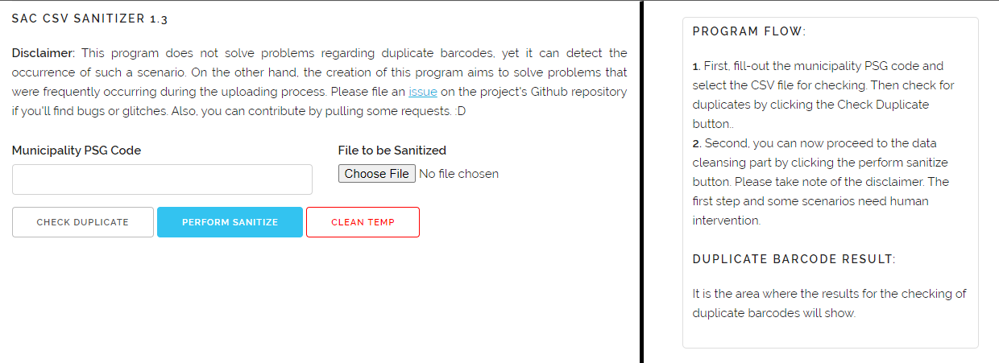

# SAC CSV (PARSER) SANITIZER PROGRAM v1.0

## Table of Contents

- [What is SAC Parser](#what-is-sac-parser)
- [How to use it](#how-to-use-it)
- [For Action](#for-action)

### What is SAC Parser
>A CSV parsing program for SAC data coming from LGUs. This program is still on its development stage. 

### How to use it?
>These are the steps needed to make sac parser running on your local machine:
1. You need to [download](https://github.com/jmmaguigad/SAC-Parser/archive/master.zip) the program.
2. Then, you need to have a web server to set-up it quickly, you can use [usbwebserver](https://usbwebserver.yura.mk.ua/).
3. Copy the sac-parser folder in the root folder of the usbwebserver.
4. Then, access the program by running the usbwebserver.exe and enabling the Apache by navigating to Apache > Start.
5. It is recommended that before performing sanitization or cleansing you need to check duplicates first. 
6. Also, it is recommended to remove duplicate barcodes because this will be returned to the LGU. After removing duplicates, you can now perform cleansing by clicking the Perform Sanitize button. A cleansed data by means of a csv file will be downloaded automatically. Then, you can now upload the csv file in the SAC Uploading website.

### For Action
**Version 1.0**
- [X] Checked barcode duplicates
- [X] Sanitize and format birthdate
- [X] Relationship to the household head, Uri ng ID, Sector and Kondisyon ng Kalusugan Finder
- [X] Proper tagging of Nakakatanda Sektor (dependent to birthdate)
- [X] Cellphone number checker
- [X] Fill-out blank Household head fields such as Benef UCT, Benef 4Ps, Katutubo, Katutubo Name, Bene Others, Others Name, Brgy. Capt and MSWDO
- [X] Compute buwanang kita includes words with per day, per week etc.

**Version 1.1**
- [X] Removed special characters excluding dash for names
- [X] Removed extra blank rows created
- [X] Reformat registration dates

**Version 1.2**
- Updated various functions and performed code cleansing.
- Fixed various issues such as issues number [1](https://github.com/jmmaguigad/SAC-Parser/issues/1), [2](https://github.com/jmmaguigad/SAC-Parser/issues/2) and [3](https://github.com/jmmaguigad/SAC-Parser/issues/3).

**Version 1.3**
- Solved multiple issues raised by focals and personnel, please refer to SAC Parser Issue.
- Added better cleansing technique for Barangay PSGC, Relationship to Household Head and other fields.
- Important patches were included, please upgrade your version.